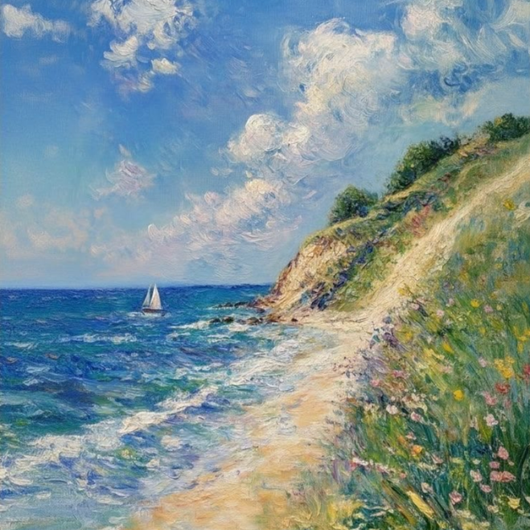

<!-- 

    

 -->

  
  
  

𝙢𝙮 𝙣𝙖𝙢𝙚 𝙞𝙨 𝙙𝙤𝙣𝙖𝙧𝙖! 𝙞 𝙖𝙢 𝙖 𝙘𝙤𝙢𝙥𝙪𝙩𝙚𝙧 𝙨𝙘𝙞𝙚𝙣𝙘𝙚 𝙨𝙩𝙪𝙙𝙚𝙣𝙩 𝙖𝙩 𝙩𝙝𝙚 𝙪𝙣𝙞𝙫𝙚𝙧𝙨𝙞𝙩𝙮 𝙤𝙛 𝙬𝙖𝙨𝙝𝙞𝙣𝙜𝙩𝙤𝙣 𝙬𝙝𝙤 𝙡𝙤𝙫𝙚𝙨 𝙩𝙤 𝙗𝙪𝙞𝙡𝙙 𝙖𝙣𝙙 𝙡𝙚𝙖𝙧𝙣
    𝙞'𝙢 𝙤𝙥𝙚𝙣 𝙩𝙤 𝙘𝙤𝙣𝙩𝙧𝙞𝙗𝙪𝙩𝙞𝙣𝙜 𝙩𝙤 𝙤𝙥𝙚𝙣 𝙨𝙤𝙪𝙧𝙘𝙚 𝙥𝙧𝙤𝙟𝙚𝙘𝙩𝙨!

<!-- 

  

 -->

## About Me

- ☁️ I'm currently building **Sellstice** & **Sylth**
- 🧸 Interested in AI systems, agents, and applied ML
- 💻 Previously interned at **Picsart**, am currently Interning at **Bramsler**
- 📼 Studying Computer Science at the **University of Washington**
- 🫧 I speak Armenian, Russian, and English
- 👩🏼‍💻 Reach me on [LinkedIn](https://www.linkedin.com/in/donara-galstyan/) or <a href="mailto:donna.galstyan.31@gmail.com">email</a>
